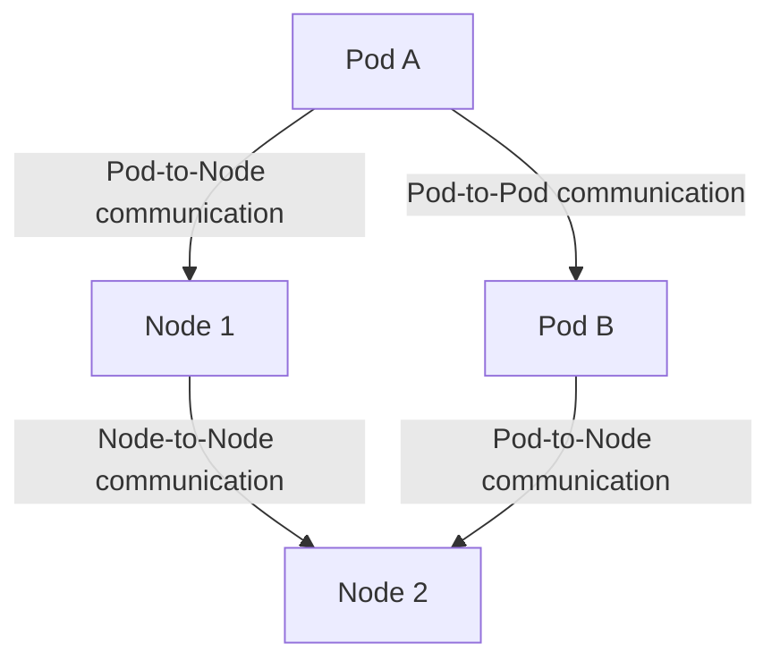

# 네트워킹

Kubernetes 네트워킹은 파드, 서비스, 인그레스 등 다양한 네트워크 리소스와 컴포넌트를 통합하여 안정적이고 확장 가능한 애플리케이션 배포를 가능하게 하는 방법을 제공합니다. 이 문서에서는 Kubernetes 네트워킹 체계의 주요 요소와 작동 방식에 대해 자세히 설명합니다.

## 목차

- [개요](#개요)
- [파드 네트워크](#파드-네트워크)
- [서비스 네트워크](#서비스-네트워크)
- [인그레스](#인그레스)
- [네트워크 정책](#네트워크-정책)
- [CNI 플러그인](#cni-플러그인)
- [예제](#예제)
- [결론](#결론)

## 개요

Kubernetes 네트워크는 특정 네트워킹 요구 사항과 원칙을 기반으로 설계되었습니다:

1. **파드 간 통신**: 모든 파드는 서로 통신할 수 있어야 합니다.
2. **노드 간 통신**: 모든 노드는 서로 통신할 수 있어야 합니다.
3. **파드-노드 통신**: 파드와 호스트 노드 간에 통신할 수 있어야 합니다.



## 파드 네트워크

### 1. IP 주소 할당
Kubernetes는 각 파드에 유니크한 IP 주소를 할당합니다. 이것은 파드 간 통신을 단순화하며, 오버레이 네트워크 없이도 가능하게 합니다.

### 2. DNS
Kubernetes는 CoreDNS 또는 kube-dns와 같은 DNS 서비스를 제공하여, 파드와 서비스의 이름 해석을 지원합니다.

## 서비스 네트워크

### 1. ClusterIP
클러스터 내에서만 접근할 수 있는 IP를 서비스에 할당합니다.

### 2. NodePort
클러스터 외부에서 서비스에 접근할 수 있도록 노드의 특정 포트를 할당합니다.

### 3. LoadBalancer
외부 로드 밸런서를 사용하여 서비스에 접근할 수 있습니다.

## 인그레스

인그레스는 클러스터 외부에서 클러스터 내부 서비스에 접근하기 위한 HTTP와 HTTPS 경로를 정의하는 API 객체입니다.

## 네트워크 정책

네트워크 정책을 통해 파드 간의 트래픽 흐름을 제어할 수 있습니다.

## CNI 플러그인

CNI(Container Network Interface) 플러그인은 파드 네트워킹을 담당합니다. 일반적인 플러그인으로는 Calico, Flannel, Weave 등이 있습니다.

## 예제

아래 YAML 파일은 ClusterIP 서비스를 생성하는 예입니다.

```yaml
apiVersion: v1
kind: Service
metadata:
  name: my-service
spec:
  selector:
    app: MyApp
  ports:
    - protocol: TCP
      port: 80
      targetPort: 9376
```

## 결론

Kubernetes 네트워킹 체계는 클러스터 내 외부 통신을 관리하고, 안정적이고 확장 가능한 애플리케이션 배포를 지원합니다. 파드 네트워크, 서비스 네트워크, 인그레스, 네트워크 정책 등 다양한 리소스와 컴포넌트를 통해 복잡한 네트워크 요구 사항을 처리할 수 있습니다.