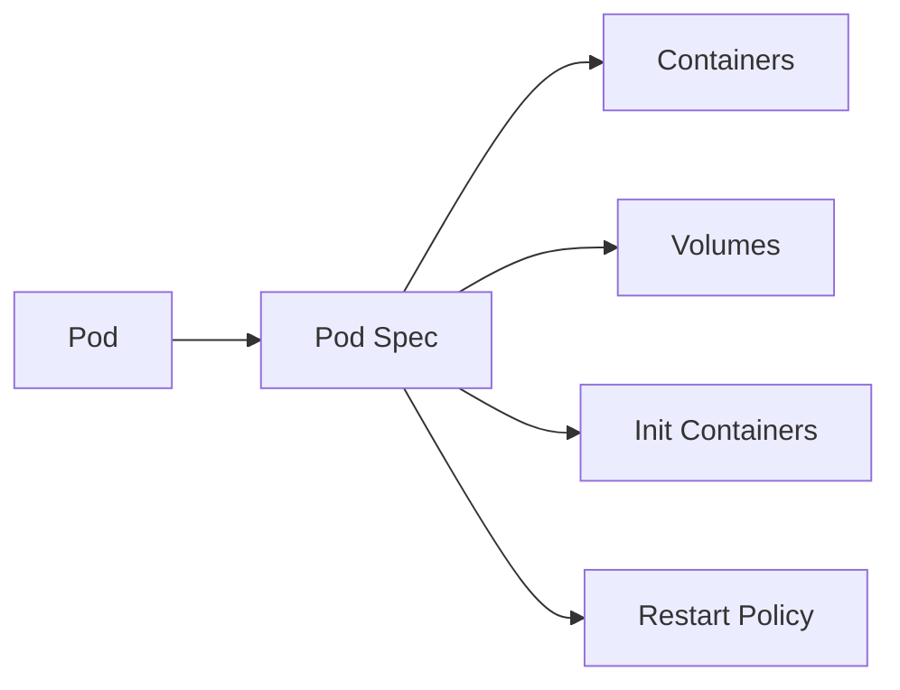

# Pod Spec

Pod Spec (Pod Specification)는 Kubernetes Pod의 설정과 속성을 정의하는 중요한 구성 요소입니다. Pod Spec은 YAML 또는 JSON 형식의 파일로 작성되며, 이 파일을 사용하여 파드의 원하는 상태를 정의하고 생성할 수 있습니다.

## 목차

- [개요](#개요)
- [Pod Spec의 주요 구성 요소](#pod-spec의-주요-구성-요소)
- [예제](#예제)
- [결론](#결론)

## 개요

Pod Spec은 파드를 생성하기 위한 "레시피"로 생각할 수 있으며, 파드와 그것의 컨테이너가 어떻게 작동해야 하는지에 대한 상세한 정보를 담고 있습니다.



## Pod Spec의 주요 구성 요소

### 1. Containers

Pod는 하나 이상의 컨테이너로 구성됩니다. 컨테이너 섹션에서는 컨테이너 이미지, 환경 변수, 포트 등을 정의합니다.

```yaml
containers:
  - name: nginx-container
    image: nginx:1.14.2
```

### 2. Volumes

Pod에서 사용할 볼륨을 정의하며, 여러 컨테이너에서 데이터를 공유하고 저장할 수 있도록 합니다.

```yaml
volumes:
  - name: shared-data
    emptyDir: {}
```

### 3. Init Containers

파드가 시작되기 전에 실행되어야 하는 초기화 컨테이너를 정의합니다. 모든 초기화 컨테이너가 성공적으로 완료된 후에 메인 컨테이너가 시작됩니다.

```yaml
initContainers:
  - name: init-myservice
    image: busybox:1.28
```

### 4. Restart Policy

Pod에 대한 재시작 정책을 정의합니다. 가능한 값은 `Always`, `OnFailure`, `Never`입니다.

```yaml
restartPolicy: Always
```

## 예제

다음은 간단한 Pod Spec 예제입니다:

```yaml
apiVersion: v1
kind: Pod
metadata:
  name: mypod
spec:
  containers:
  - name: mycontainer
    image: nginx:1.14.2
    ports:
    - containerPort: 80
  volumes:
  - name: shared-data
    emptyDir: {}
  restartPolicy: Always
```

이 Pod Spec에서는 nginx 이미지를 사용하는 단일 컨테이너와 공유 볼륨, 그리고 "Always" 재시작 정책을 정의하고 있습니다.

## 결론

Pod Spec은 Kubernetes Pod의 구성과 동작을 정의하는 중심적인 요소입니다. Pod Spec을 작성하고 이해하는 것은 Kubernetes에서 애플리케이션을 효과적으로 배포하고 관리하는 데 핵심적입니다.