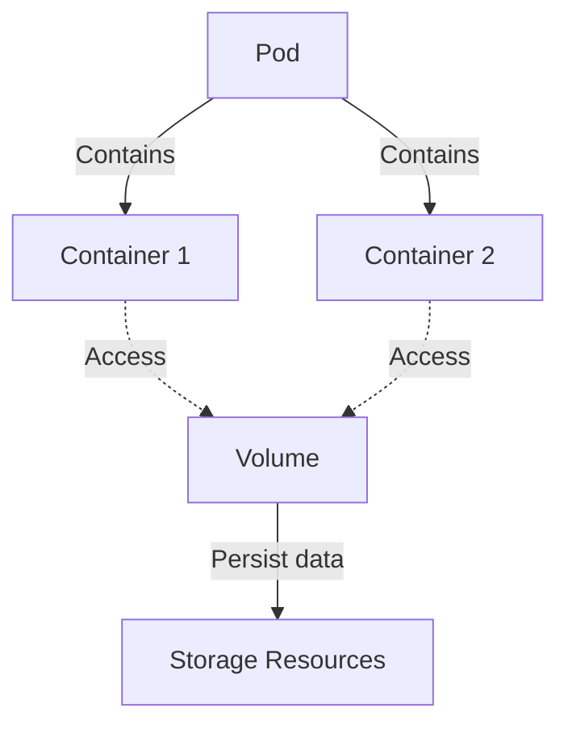

# Volume

Kubernetes Volume은 파드 내의 컨테이너들이 데이터를 공유하고 저장할 수 있도록 하는 객체입니다. Volume은 컨테이너의 파일 시스템에 마운트되며, 데이터는 컨테이너가 삭제되더라도 Volume에 유지됩니다. 이 문서에서는 Volume의 개념, 종류, 사용 방법에 대해 자세히 설명합니다.

## 목차

- [개요](#개요)
- [Volume의 종류](#volume의-종류)
- [Volume 사용 방법](#volume-사용-방법)
- [예제](#예제)
- [결론](#결론)

## 개요

Volume은 Pod의 일부로서, 컨테이너의 파일 시스템을 확장하는 방법을 제공합니다. Volume은 파드의 스펙에 정의되며, 파드와 동일한 생명주기를 갖습니다.



## Volume의 종류

Kubernetes는 다양한 종류의 Volume을 지원합니다. 여기에서는 몇 가지 주요 Volume 유형에 대해 설명합니다.

### 1. emptyDir

- **특징**: 파드가 할당된 노드의 일시적인 스토리지에 데이터를 저장합니다.
- **사용 경우**: 컨테이너 간에 데이터를 임시로 공유할 때 사용합니다.

### 2. hostPath

- **특징**: 노드의 로컬 파일 시스템에 직접 접근하여 데이터를 저장합니다.
- **사용 경우**: 노드의 파일 시스템을 컨테이너에 마운트해야 하는 경우에 사용합니다.

### 3. persistentVolume (PV) & persistentVolumeClaim (PVC)

- **특징**: 클러스터의 스토리지 리소스를 추상화하고, 스토리지를 동적 또는 정적으로 프로비저닝합니다.
- **사용 경우**: 데이터를 영구적으로 저장하고 관리하는 데 사용됩니다.

## Volume 사용 방법

Volume을 사용하려면 먼저 Pod 스펙에서 Volume을 정의한 후, 해당 Volume을 컨테이너에 마운트해야 합니다.

### 1. Volume 정의

파드 스펙의 `volumes` 섹션에서 Volume을 정의합니다.

```yaml
apiVersion: v1
kind: Pod
metadata:
  name: mypod
spec:
  containers:
  - name: myfrontend
    image: nginx
    volumeMounts:
    - mountPath: "/var/www/html"
      name: myvolume
  volumes:
  - name: myvolume
    emptyDir: {}
```

### 2. Volume 마운트

컨테이너 스펙의 `volumeMounts` 섹션에서 Volume을 마운트합니다.

```yaml
volumeMounts:
- mountPath: "/var/www/html"
  name: myvolume
```

## 예제

다음은 PersistentVolume과 PersistentVolumeClaim을 사용하여 MySQL 데이터베이스의 데이터를 영구적으로 저장하는 예입니다.

```yaml
apiVersion: v1
kind: PersistentVolume
metadata:
  name: mysql-pv
spec:
  capacity:
    storage: 1Gi
  volumeMode: Filesystem
  accessModes:
    - ReadWriteOnce
  hostPath:
    path: "/mnt/data"
---
apiVersion: v1
kind: PersistentVolumeClaim
metadata:
  name: mysql-pvc
spec:
  accessModes:
    - ReadWriteOnce
  resources:
    requests:
      storage: 1Gi
---
apiVersion: v1
kind: Pod
metadata:
  name: mysql-pod
spec:
  containers:
  - name: mysql
    image: mysql
    env:
    - name: MYSQL_ROOT_PASSWORD
      value: "password"
    volumeMounts:
    - mountPath: "/var/lib/mysql"
      name: mysql-storage
  volumes:
  - name: mysql-storage
    persistentVolumeClaim